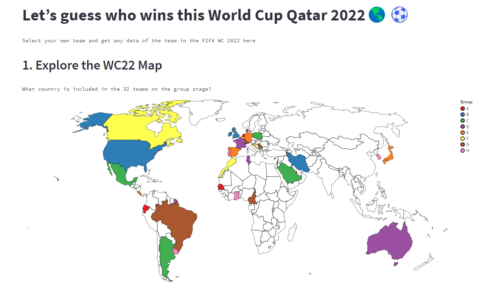

# Let’s guess who wins this World Cup Qatar 2022🌎⚽️

TODO: Update screenshot

TODO: Short abstract describing the main goals and how you achieved them.

**This project provides users with informative data about 32 teams in the FIFA World cup (WC) Qatar starting from November 20th, 2022. A user can explore the customized map and get historical WC records of any team interested. With the planned match date information, this app shows the winning rate between the opponents in the same group. **

## Project Goals

TODO: **A clear description of the goals of your project.** Describe the question that you are enabling a user to answer. The question should be compelling and the solution should be focused on helping users achieve their goals. 

**The exploration of the application aims to give an answer to the key question of how the team on the group stage can set strategies to get to the round of 16. Given that only two teams in a group could go there, most soccer fans would like to know which opponent team would be the easiest or the most challenging. Comparison analysis in terms of past(historical) and present(FIFA ranking) data will allow them to build the winning scenario this winter.**

## Design

TODO: **A rationale for your design decisions.** How did you choose your particular visual encodings and interaction techniques? What alternatives did you consider and how did you arrive at your ultimate choices?

**To set a map to show all locations of the 32 teams at once, there were two intriguing ideas: a choropleth map and scatter plot on the map (both were visualized for comparison). We made a decision based on the scale of visualization along with the principle of clarity. Some countries such as the USA or Canada were too big to be represented with one dot at some point, compared to other smaller countries in Europe. Furthermore, it was obvious that colored dots were even harder to clearly show 8 different groups at a time. **

## Development

TODO: **An overview of your development process.** Describe how the work was split among the team members. Include a commentary on the development process, including answers to the following questions: Roughly how much time did you spend developing your application (in people-hours)? What aspects took the most time?

**Starting with the interesting question, we both have enjoyed shaping this idea for about two weeks. There were a couple of zoom and in person meetings for us to brainstorm, synthesize findings and share the progress. At the scripting phase, we split the things to do in order. We have five steps of flowing data feeds in the app: (1) Explore the WC22 Map (2) Set your team (3) Get to know your team (4) Get to know the opponents (5) Analyze the two teams. Jeffrey collected the WC22 data, built the baseline code with input interaction, and completed (2), (4), (5). Ninad collected the historical WC data, completed (1), (3), and combined two codes into one deployed. It is possibly estimated that 1.5-2 hours a day were spent for the past week developing the application including all the work and meetings. Building the baseline code took the most time for Jeffrey, while data cleaning for Ninad.**

## Success Story

TODO:  **A success story of your project.** Describe an insight or discovery you gain with your application that relates to the goals of your project.

**We clearly see that interactive data works for comparison analysis. It helps us not only to query the setting but also to get insightful information when needed. In this case, reviewing two teams side-by-side with intuitive performance data enables a user to predict the match result. As mentioned earlier, getting to the round of 16 of the WC requires a team to win and draw at least once in the group stage. Then, the last result would be a key: winning or draw will guarantee the next but losing the game won’t.**
